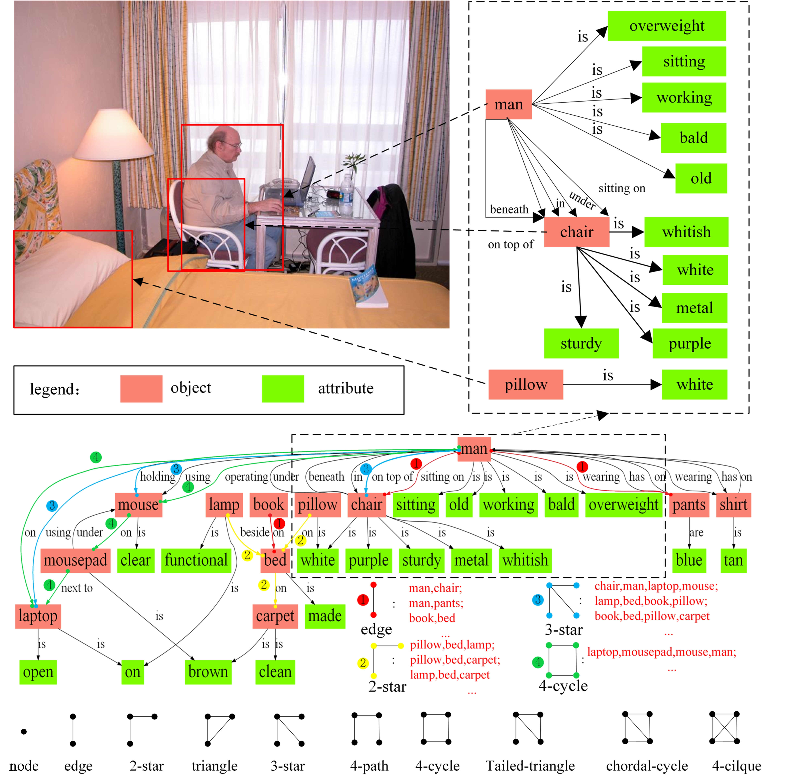
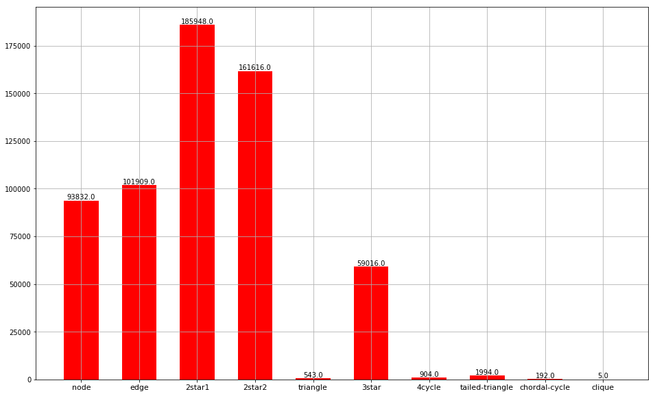

# motif dataset

The motif dataset is constructed on the basis of Johnson’s real-world scene graphs dataset[^1], Based on in-depth understanding and analysis of the content and structure of the scene graph, we selected 10 typical motifs whose structures are shown which can be used as the basic unit of the scene graph. Each motif here is a local scene struct that contains information about classes, attributes of objects and relationships between objects. We ensure that all scene graphs in our scene graph dataset can be represented as the combinations of these motifs. Our motif dataset has about 3 million motifs, containing about 93,000 node motifs, 90,000 edge motifs, 220,000 2-star motifs, 15,000 triangle motifs, 1,700,000 3-star motifs, 370,000 4-path motifs, 33,000 4-cycle motifs, 239,000 tailed-triangle motifs, 34,000 chordal-cycle motifs and 3,000 4-cilque motifs respectively. 

[^1]: [Image retrieval using scene graphs](https://cs.stanford.edu/people/jcjohns/cvpr15_supp/)